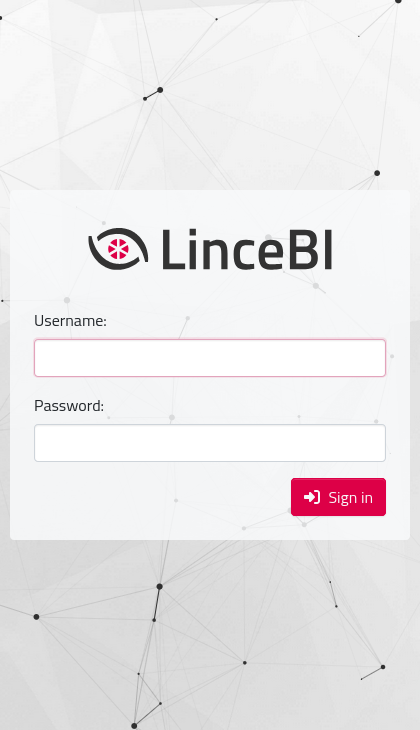
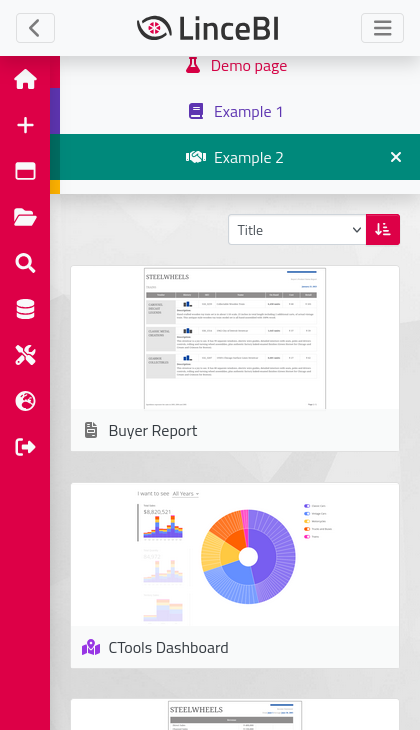
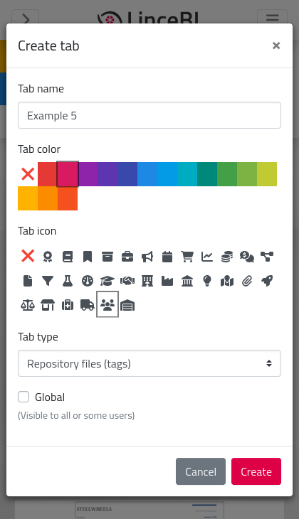
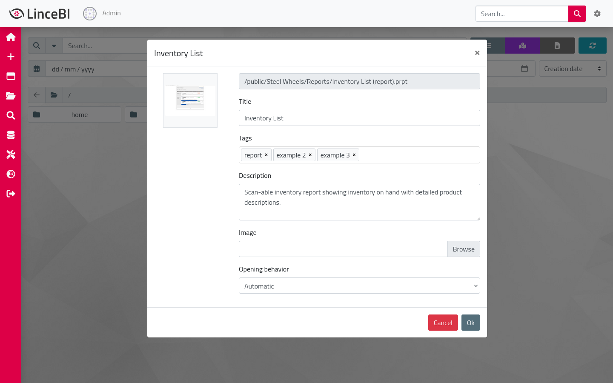
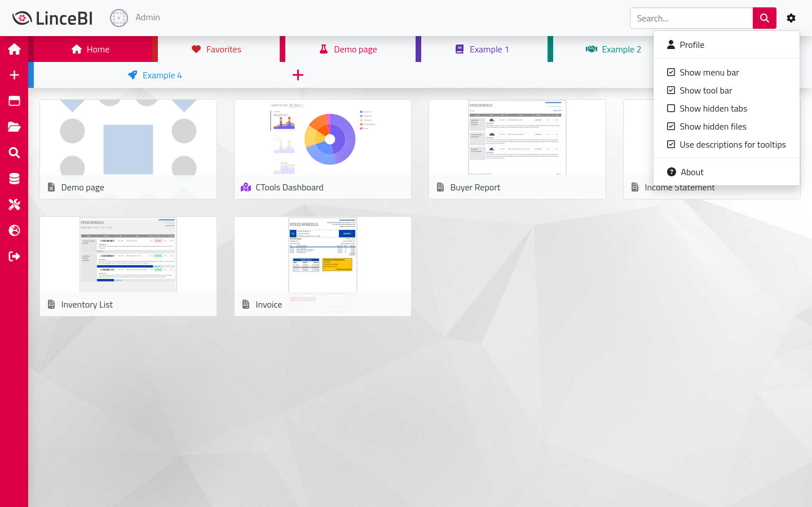
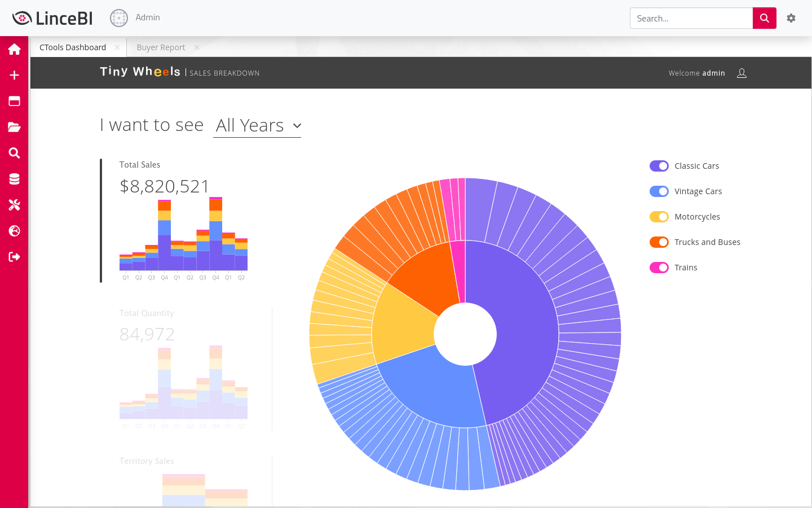

\hypersetup{linkcolor=black}
\tableofcontents

# Introducción

El siguiente documento presenta un manual de instalación y uso de la personalización de Stratebi
de Pentaho BI Server.

Es un desarrollo web moderno con ECMAScript 2018+, Vue.js, Bootstrap y SASS que reemplaza las
vistas de Pentaho BI Server `/Login` y `/Home`.

Se ha realizado de la forma más independiente posible a Pentaho BI Server, con el fin de facilitar
las actualizaciones a futuras versiones. Toda la comunicación con el servidor se realiza
exclusivamente mediante su API REST.

## Soporte para navegadores

 * Las dos últimas versiones de Google Chrome.
 * Las dos últimas versiones de Mozilla Firefox.
 * Las dos últimas versiones de Microsoft Edge.
 * Las dos últimas versiones de Safari.
 * Las dos últimas versiones de iOS.
 * Las dos últimas versiones de Opera.
 * Mozilla Firefox Extended Support Release (ESR).
 * **Ninguna versión de Internet Explorer.**

# Compilación

## Requisitos

 * GNU/Linux.
 * [Node.js](https://nodejs.org/en/download/package-manager/).
 * [Docker](https://docs.docker.com/install/).
 * [Docker Compose](https://docs.docker.com/compose/install/).
 * Los siguientes paquetes: `git` `jq` `make` `maven` `tmux`.

## Pasos

 1. Descargar y descomprimir un Pentaho BI Server 8.2 original en el directorio
    `./biserver/overlay/` (sin sobreescribir los archivos existentes).

 2. Descargar las dependencias.
    ```sh
     npm install
    ```

 3. Compilar el proyecto.
    ```sh
     make build
    ```

 4. El resultado de la compilación podrá encontrarse en el directorio `./dist/`.

## Workflow de desarrollo

 1. Iniciar Pentaho BI Server y el proxy inverso.
    ```sh
     make start-biserver
    ```

 2. En otra terminal, iniciar los dev server de Webpack.
    ```sh
     make start-devserver
    ```

 3. Cuando ambos servicios estén en marcha, acceder a `http://localhost:2015/`
    (los dev servers se encargarán de recompilar el proyecto en caliente con cada cambio).

## Estructura del proyecto

```
 .
 ├── biserver/               # Proyecto con la configuración y tema de Pentaho BI
 |   |                         Server.
 │   ├── overlay/            # Durante el desarrollo este directorio contiene una
 |   |                         instalación completa de Pentaho BI Server, pero todos
 |   |                         los archivos están ignorados excepto los que sean
 |   |                         necesarios (ver .gitignore).
 │   └── Makefile
 ├── docker/                 # Contenedor de Docker que mediante un proxy inverso
 |   |                         sustituye las vistas "/Login" y "/Home" por el dev
 |   |                         server de Webpack.
 │   ├── Caddyfile
 │   └── docker-compose.yml
 ├── packages/               # Paquetes de Node.js.
 │   ├── common/             # Código compartido por el resto de paquetes.
 │   │   ├── src/
 │   │   └── package.json
 │   ├── home/               # Proyecto de Vue.js que reemplaza la vista "/Home".
 │   │   ├── src/
 │   │   └── package.json
 │   └── login/              # Proyecto de Vue.js que reemplaza la vista "/Login".
 │       ├── src/
 │       └── package.json
 ├── lerna.json              # Configuración de Lerna (ver https://lerna.js.org).
 ├── Makefile                # Makefile principal que contiene tareas para iniciar
 |                             Pentaho BI Server, iniciar los dev server de Webpack
 |                             de cada paquete y compilar el proyecto.
 └── package.json
```

# Instalación

Descomprimir y reemplazar el contenido del archivo `.tgz` sobre una instalación de Pentaho BI
Server.

De ya existir los directorios `./tomcat/webapps/pentaho/Login/` y
`./tomcat/webapps/pentaho/Home/`, deben ser borrados previamente.

**Nota:** esta personalización es dependiente de los plugins
 [STSearch](https://gitlab.stratebi.com/stratebi/customizations/stsearch),
 [file-metadata](https://gitlab.stratebi.com/stratebi/customizations/file-metadata) y
 [global-user-settings](https://gitlab.stratebi.com/stratebi/customizations/global-user-settings).

## Estructura del paquete compilado

```
 .
 ├── pentaho-solutions/
 │   └── system/
 │       ├── common-ui/
 │       │   ├── resources/
 │       │   │   └── themes/
 │       │   │       └── stratebi/    # Tema de Pentaho BI Server heredado del tema
 |       |   |                          Ruby.
 │       │   └── themes.xml           # El único cambio en ese archivo es la
 |       |                              definición del tema Stratebi.
 │       └── pentaho.xml              # El único cambio en ese archivo es la
 |                                      definición del tema por defecto.
 └── tomcat/
     └── webapps/
         └── pentaho/
             ├── Home/                # Vista "/Home" que reemplaza al servlet
             |                          "Home" de "web.xml".
             ├── Login/               # Vista "/Login" que reemplaza al servlet
             |                          "Login" de "web.xml".
             ├── mantle/
             │   ├── themes/
             │   │   └── stratebi/    # Tema de Pentaho BI Server heredado del tema
             |   |                      Ruby.
             │   ├── MantleBridge.jsp # Reescritura de Mantle.jsp que es utilizada a
             |   |                      modo de puente para que la personalización
             |   |                      pueda cargar las perspectivas originales de
             |   |                      Pentaho BI Server.
             │   └── themes.xml       # El único cambio en ese archivo es la
             |                          definición del tema Stratebi.
             └── WEB-INF/
                 └── web.xml          # Los cambios en ese archivo son la
                                        desactivación de los servlets "Login" y
                                        "Home" y la definición de nuevos servlets.
```

# Vista previa

## /Login

Lo primero que el usuario verá al entrar en la personalización es la siguiente vista, en la que se
le ofrecerá iniciar sesión.

{width=512px}
{width=128px}

######

## /Home

### Pestañas

Esta es la vista inicial de la personalización, en ella se presenta una navegación por pestañas que
muestran los archivos que el administrador y el usuario han elegido.

Por defecto, las dos únicas pestañas que aparecen son "Global" e "Inicio", en la primera es el
administrador quien elige los archivos que se muestran haciendo click en el icono de la bola del
mundo en el buscador, y en la segunda es el usuario quien hace esto haciendo click en el icono de la
casa.

Tanto el administrador como el usuario pueden arrastrar en su respectiva pestaña los archivos para
que se muestren en el orden que desee.

{width=512px}
{width=128px}

######

El resto de pestañas de ejemplo que se ven en la imagen muestran los archivos del repositorio que
contienen una etiqueta con el mismo nombre que la pestaña. Estas etiquetas son definidas en el
buscador.

{width=512px}
{width=128px}

Estas pestañas pueden ser creadas y cambiadas de orden por el usuario, en ellas se define un nombre,
color e icono.

{width=512px}
{width=128px}

######

### Buscador

Desde el buscador el usuario ve los archivos de un directorio de forma recursiva. Puede explorar
todo el árbol de directorios y filtrar los archivos en base a unos criterios definidos en la sección
superior de la vista.

{width=512px}
{width=128px}

El usuario puede editar los metadatos de los archivos y estos son guardados en el idioma
seleccionado (a excepción de la imagen y las etiquetas, que son los mismos independientemente del
idioma).

{width=512px}
{width=128px}

######

### Perfil

La siguiente vista es la del perfil del usuario, la cual puede accederse haciendo click en la imagen
de perfil o desde el menú de opciones superior.

En ella el usuario puede actualizar su imagen e introducir su nombre, email, teléfono y dirección.

Estos datos podrán ser utilizados posteriormente en otras vistas de la personalización o plugins de
Pentaho BI Server.

{width=512px}\

{width=512px}
{width=128px}

######

### Administración

La última vista propia implementada es administración, que puede ser accedida desde el menú lateral.

En ella el administrador podrá acceder a distintas secciones para gestionar Pentaho BI Server, como
la gestión de fuentes de datos, programaciones o marketplace, así como vaciar las cachés del
servidor.

{width=512px}
{width=128px}

######

### Perspectivas estándar

Las perspectivas incluidas en Pentaho BI Server, como el explorador de archivos o los archivos
abiertos, siguen existiendo y pueden ser accedidas desde la barra lateral o desde
`/pentaho/Home/#/p/nombre_de_perspectiva` en la URL.

{width=512px}
{width=128px}

{width=512px}
{width=128px}
