\pagestyle{fancy}

\fancyhead[LO,LE]{\leftmark}
\fancyhead[CO,CE]{}
\fancyhead[RE,RO]{\includegraphics[width=0.6cm]{./assets/images/stratebi.png}}

\fancyfoot[LE,LO]{}
\fancyfoot[CO,CE]{}
\fancyfoot[RE,RO]{\thepage}

\hypersetup{linkcolor=black}

\renewcommand\contentsname{Índice}
\tableofcontents

# Introducción

El siguiente documento presenta un manual de uso de LinceBI, basado en Pentaho BI Server.

## Soporte para navegadores

 * Las dos últimas versiones de Google Chrome.
 * Las dos últimas versiones de Mozilla Firefox.
 * Las dos últimas versiones de Microsoft Edge.
 * Las dos últimas versiones de Safari.
 * Las dos últimas versiones de iOS.
 * Las dos últimas versiones de Opera.
 * Mozilla Firefox Extended Support Release (ESR).
 * **Ninguna versión de Internet Explorer.**

# Uso

## /Login

Lo primero que el usuario verá al entrar en LinceBI es la siguiente vista, en la que se le ofrecerá
iniciar sesión.

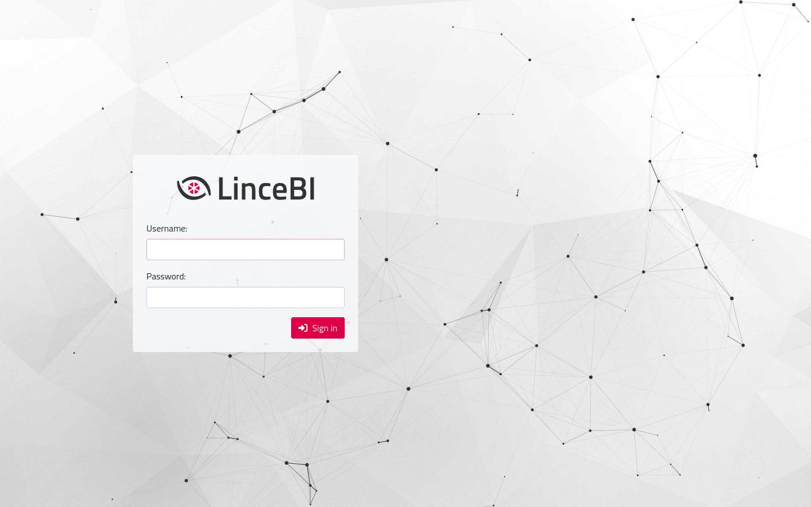{width=512px}
{width=128px}

######

## /Home

### Pestañas

Esta es la vista inicial de LinceBI, en ella se presenta una navegación por pestañas que muestran
los archivos que el administrador y el usuario han elegido.

Por defecto, las dos únicas pestañas que aparecen son "Global" e "Inicio", en la primera es el
administrador quien elige los archivos que se muestran a todos los usuarios y en la segunda es el
usuario quien elige los archivos que exclusivamente desea ver.

Tanto el administrador como el usuario pueden arrastrar en su respectiva pestaña los archivos para
que se muestren en el orden que desee.

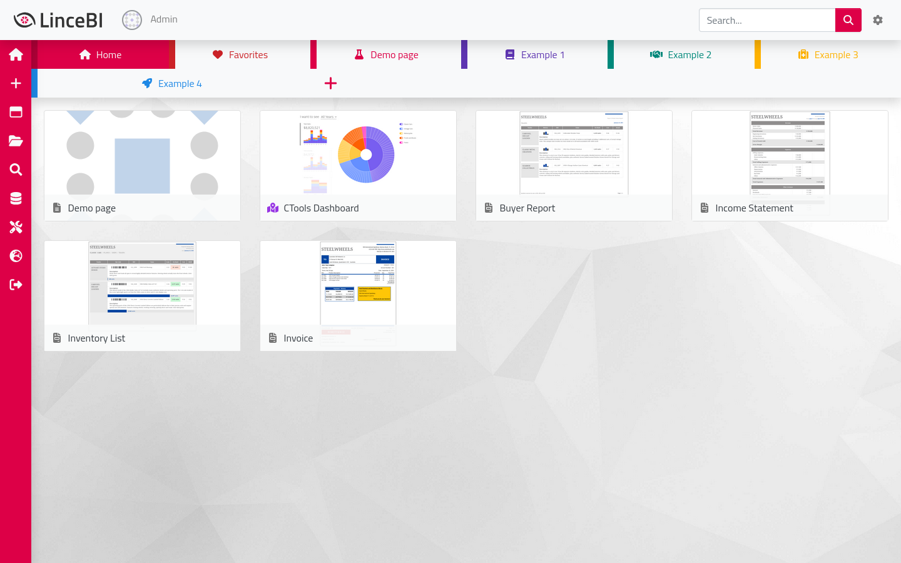{width=512px}
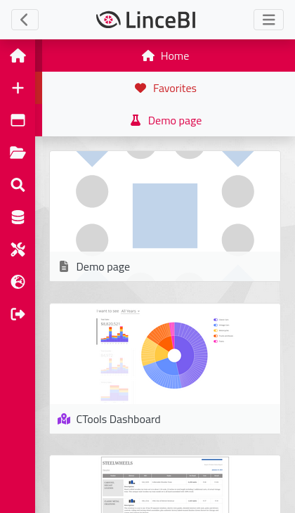{width=128px}

######

El resto de pestañas de ejemplo que se ven en la imagen muestran los archivos del repositorio que
contienen una etiqueta con el mismo nombre que la pestaña. Estas etiquetas son definidas en el
buscador.

{width=512px}
{width=128px}

Estas pestañas pueden ser creadas y cambiadas de orden por el usuario, en ellas se define un nombre,
color e icono.

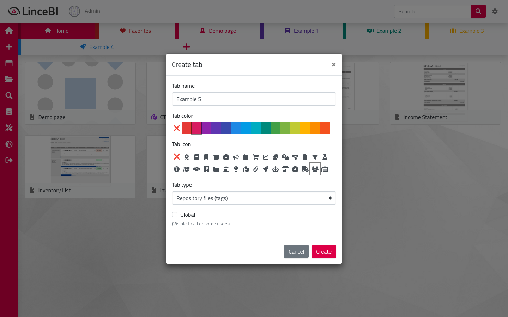{width=512px}
{width=128px}

######

### Buscador

Desde el buscador el usuario ve los archivos de un directorio de forma recursiva. Puede explorar
todo el árbol de directorios y filtrar los archivos en base a unos criterios definidos en la sección
superior de la vista.

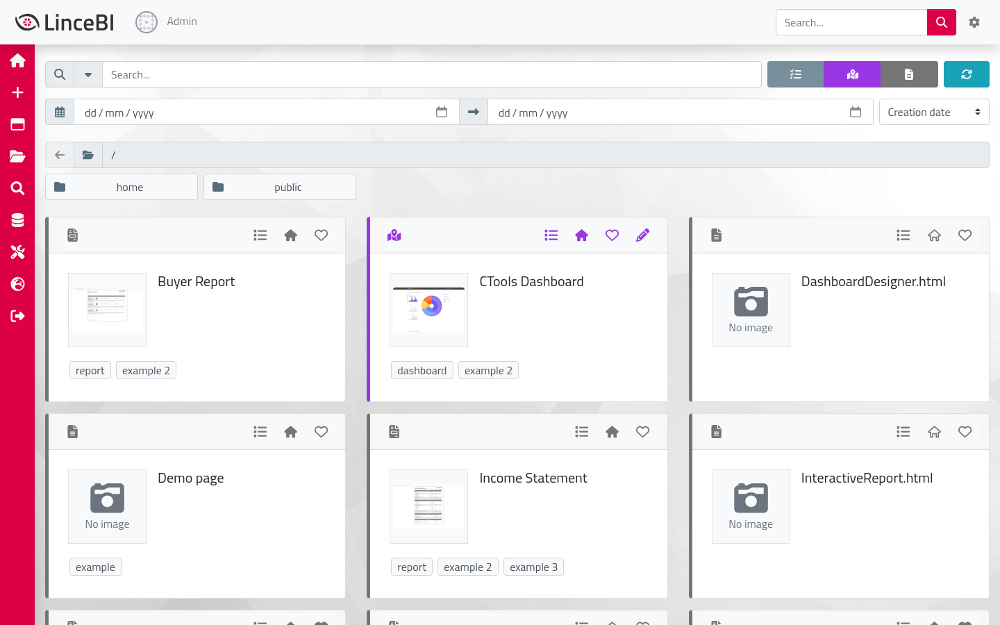{width=512px}
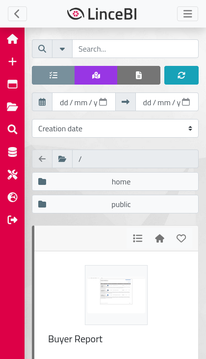{width=128px}

El usuario puede editar los metadatos de los archivos y estos son guardados en el idioma
seleccionado (a excepción de la imagen y las etiquetas, que son los mismos independientemente del
idioma).

{width=512px}
{width=128px}

######

### Perfil

La siguiente vista es la del perfil del usuario, la cual puede accederse haciendo click en la imagen
de perfil o desde el menú de opciones superior.

En ella el usuario puede actualizar su imagen e introducir su nombre, email, teléfono y dirección.

Estos datos podrán ser utilizados posteriormente en otras vistas o plugins de LinceBI.

{width=512px}
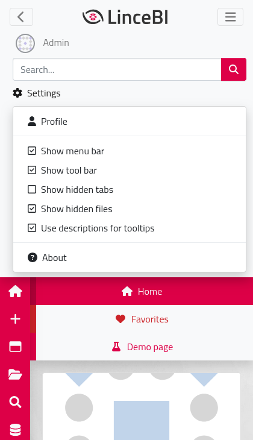{width=128px}

{width=512px}
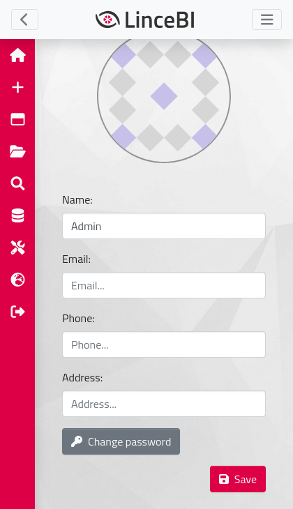{width=128px}

######

### Administración

La última vista propia implementada es administración, que puede ser accedida desde el menú lateral.

En ella el administrador podrá acceder a distintas secciones para gestionar la plataforma, como la
gestión de fuentes de datos, programaciones o marketplace, así como vaciar las cachés del
servidor.

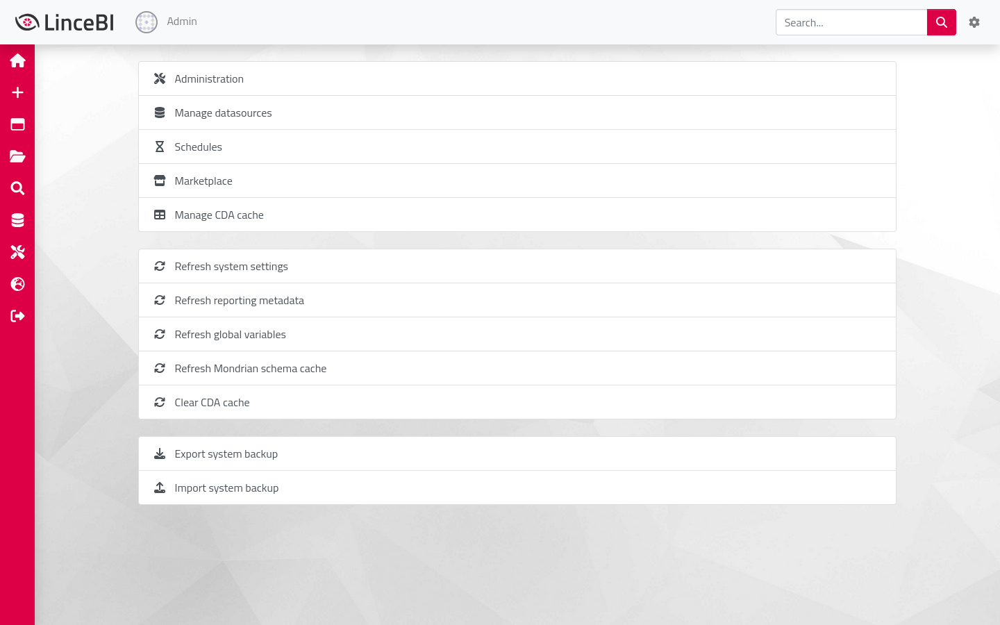{width=512px}
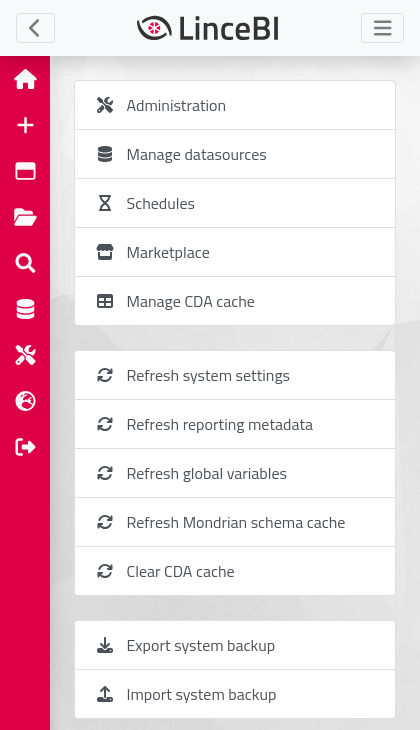{width=128px}

######

### Perspectivas estándar

Las perspectivas incluidas en Pentaho BI Server, como el explorador de archivos o los archivos
abiertos, siguen existiendo y pueden ser accedidas desde la barra lateral o desde
`/pentaho/Home/#/p/nombre_de_perspectiva` en la URL.

{width=512px}
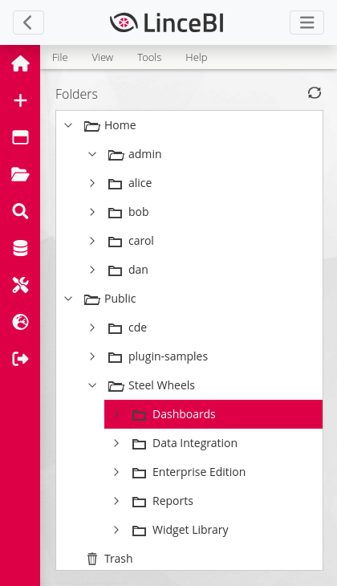{width=128px}

{width=512px}
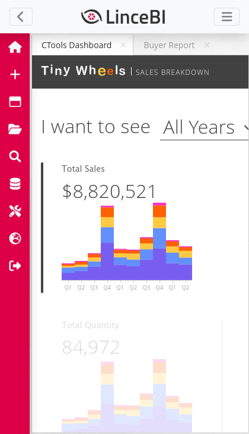{width=128px}
